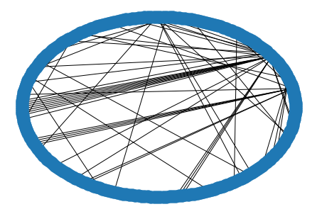

# ND State Scraper
### Operation
1. Run scrapy scraper with output to a Jason Lines file
	* `scrapy crawl nd_biz  -o biz_info.jl`
		* File will be at `nd_states_ss/nd_states_ss/biz_info.jl`
	* this will also export a pickle file of company id’s & titles
		*   `nd_states_ss/nd_states_ss/biz_title.p`
2. Run Jupyter Notebook `Data Cleaning & Viz.ipynb`
	* Will clean the data, show some known data errors
	* Will create a graph and visualize it
