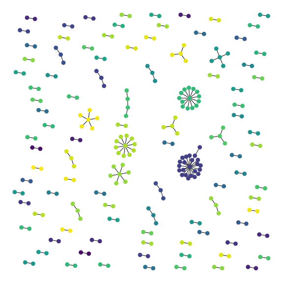

## North Dakota Secretary of Business
This repository contains a webscraper to collect data and a jupyter notebook to explore the data. The notebook also visualizes the relationships between business and owners or agents. 

  * Limited to Business with names starting with `x` which are active

### Operation
1. Run scrapy scraper with output to a Jason Lines file
	* `scrapy crawl nd_biz  -o biz_info.jl`
		* File will be at `nd_states_ss/nd_states_ss/biz_info.jl`
	* This will also export a pickle file of company id’s & titles
		*   `nd_states_ss/nd_states_ss/biz_title.p`
  
2. Run Jupyter Notebook `Data Cleaning & Viz.ipynb`
	* Will clean the data, show some known data issues
	* Will create a graph and this visualization

### Graphs of company relationships:  

  
  
### Scraper Notes 

Scrapy initially `POST`'s a small `JSON` body containing search parameters to `https://firststop.sos.nd.gov/api/Records/businesssearch`
  
This returns a `JSON` list of _all_ search results. For expeideincy, the `id` and `TITLE` are parsed and saved as a pickle file. It is joined back to ownership info in the `.ipynb`
  
Unfortunately that JSON does not contain ownership-like information. It also contains business which appear not to meet the search criteria in any way. 

For each id in the initial list of business, the scraper makes a `GET` request with the `id` in the url:`/api/FilingDetail/business/{id}/false` which yields XML. 

The resulting XML contains several types of owner-like information. In the `parse_biz` function `Mailing Address`, `Owner Name` and any tag with the text `Registered Agent` are extracted. 
  
 **Note on resolution** `owner` is its own field but both "Commercial Registered Agent" and "Registered Agent" are forced into the `agent` field. Based on [this](https://sos.nd.gov/business/registered-agents/faqs-applicable-commercial-and-noncommercial-registered-agents#item768) they appear to be extremely similar. 
 
The Scraper should take ~5min to run. Then the Jupyter notebook can be run.

### Improvments 
 * There may be more owner-like values in the FilingDetail.
 * Cleaning/fuzzy matching entity names to find more connections.
 * Associating mailing address with the business nodes.
 * Associating relationship type with the edges.